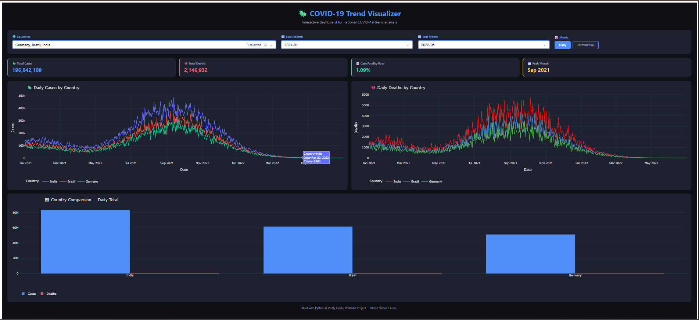
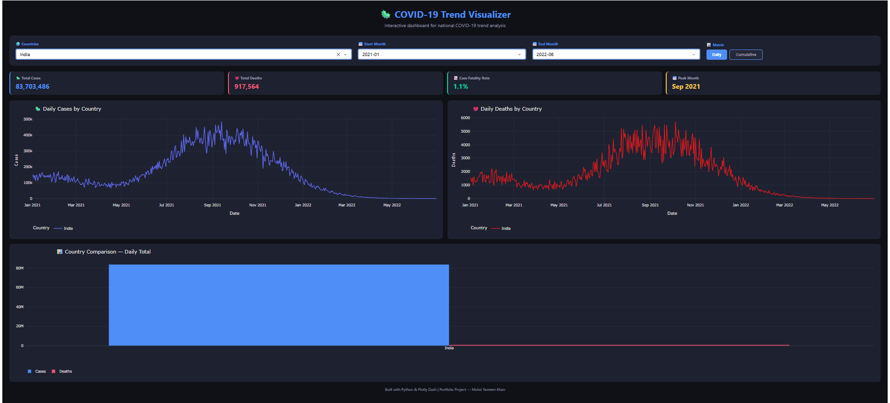
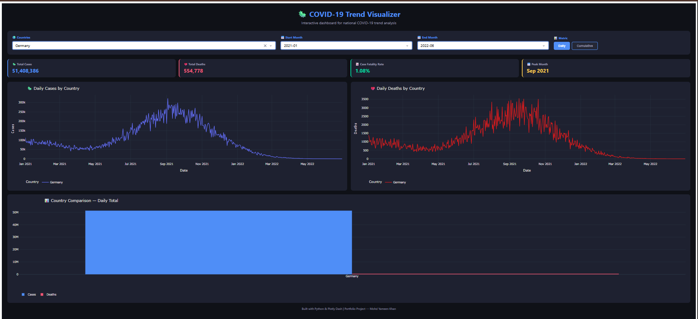
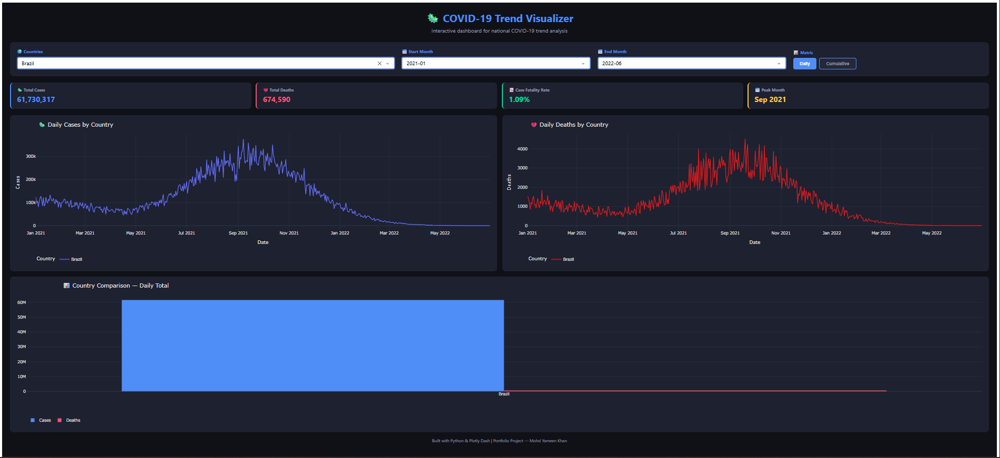

# COVID-19 Trend Visualizer

Interactive web dashboard built with Plotly Dash to visualize COVID-19
case and death trends across countries with filtering.

## Features
- Filter by country (multi-select)
- Filter by start and end month
- Toggle between Daily and Cumulative views
- KPI cards: Total Cases, Deaths, Fatality Rate, Peak Month
- 3 interactive charts: case trends, death trends, country comparison

## Tools Used
Python, Plotly Dash, Pandas

## Screenshots

### Full Dashboard

### India

### USA

### Brazil

## How to Run
pip install dash plotly pandas

python covid_dashboard.py

Open browser: http://127.0.0.1:8050
